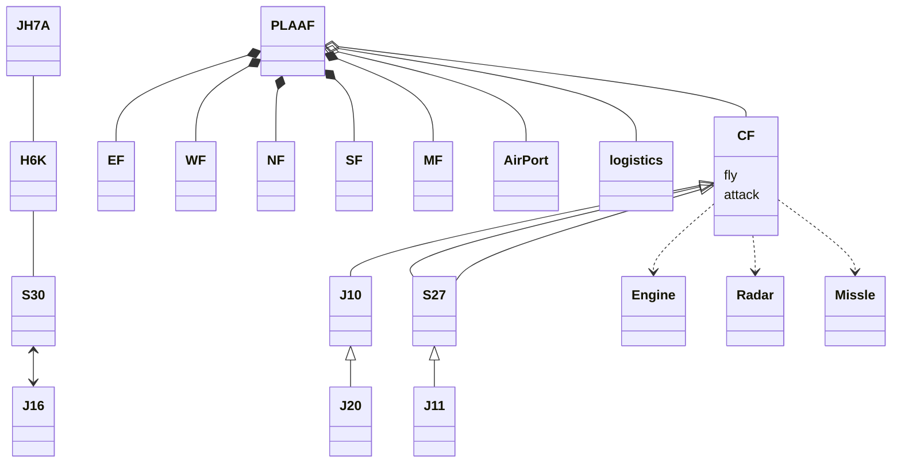

# UML常识

## 类图

### 从中国空军说起

```mermaid
classDiagram

CF <|-- S27
CF <|-- J10
J10  <|-- J20
CF <|-- S27
S27<|-- J11


PLAAF *-- EF
PLAAF *-- WF
PLAAF *-- NF
PLAAF *-- SF
PLAAF *-- MF


PLAAF o-- CF
PLAAF o-- AirPort
PLAAF o-- logistics

JH7A -- H6K
H6K -- S30
S30 <--> J16

CF ..> Engine
CF ..> Radar
CF ..> Missle


CF : fly
CF : attack

```

### 实现和泛化

实现:  继承**抽象**类

泛化 : 继承**非抽象**类

### 组合和聚合

聚合: 整体不存在, 部分依旧存在

组合:  整体不存在, 部分**不**存在

### 关联和依赖

关联: 关系双向

依赖: 关系单向

