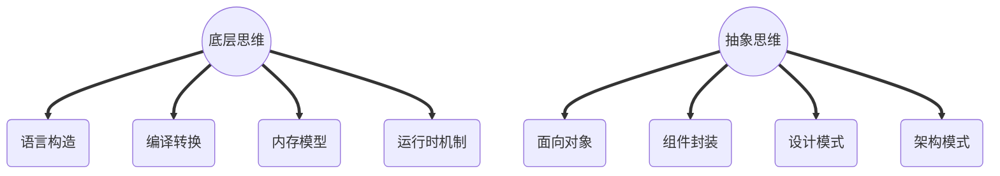
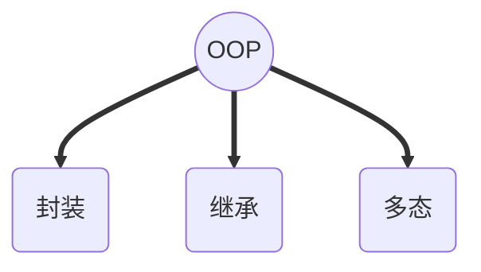
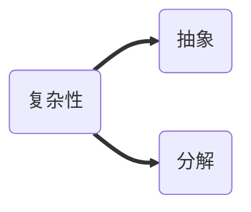

# 可复用的面向对象设计

##  底层思维和抽象思维

```mermaid
graph TB;

B((底层思维))==>D(语言构造)
B==>E(编译转换)
B==>F(内存模型)
B==>G(运行时机制)


B1((抽象思维))==>D1(面向对象)
B1==>E1(组件封装)
B1==>F1(设计模式)
B1==>G1(架构模式)

```

## 面向对象

```mermaid
graph TB;
B((OOP))==>D(封装)
B==>E(继承)
B==>F(多态)
```

## 复杂性解决方案

```mermaid
graph LR
A(复杂性)==>B(抽象)
A==>C(分解)
```

## 软件设计的金科玉律

通过面向对象的高阶方法,提高代码

复用性!!!!!

