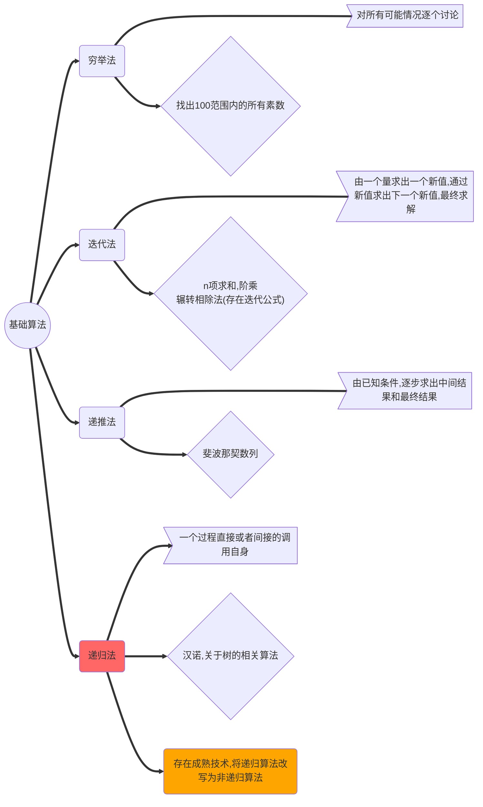
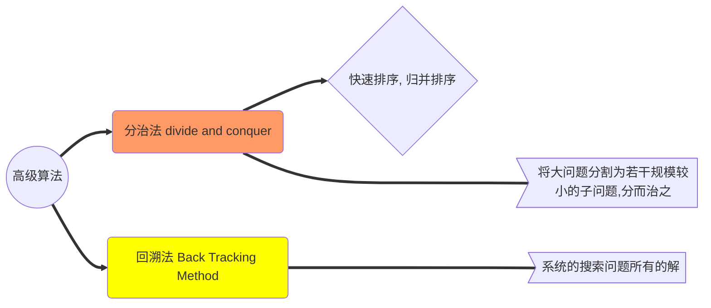

## 基本算法 

```mermaid
graph LR
A((基础算法))==>B(穷举法)
B====B1>"对所有可能情况逐个讨论"]
B==>B2{找出100范围内的所有素数}

A==>C(迭代法)
C====C1>"由一个量求出一个新值,通过新值求出下一个新值,最终求解"]
C==>C2{"n项求和,阶乘<br/>辗转相除法(存在迭代公式)"}

A==>D(递推法)
D====D1>"由已知条件,逐步求出中间结果和最终结果"]
D==>D2{斐波那契数列}

A==>E(递归法)
E==>E1>"一个过程直接或者间接的调用自身"]
E==>E2{汉诺,关于树的相关算法}
E==>E3(存在成熟技术,将递归算法改写为非递归算法)

style E fill:#ff6666
style E3 fill:orange
```

## 高级算法

```mermaid
graph LR
A((高级算法))==>B(分治法 divide and conquer)
B====B1>"将大问题分割为若干规模较小的子问题,分而治之"]
B==>B2{快速排序, 归并排序}

A==>C(回溯法 Back Tracking Method)
C====C1>"系统的搜索问题所有的解"]
style B fill:#FF9966
style C fill:#FFFF00
```

