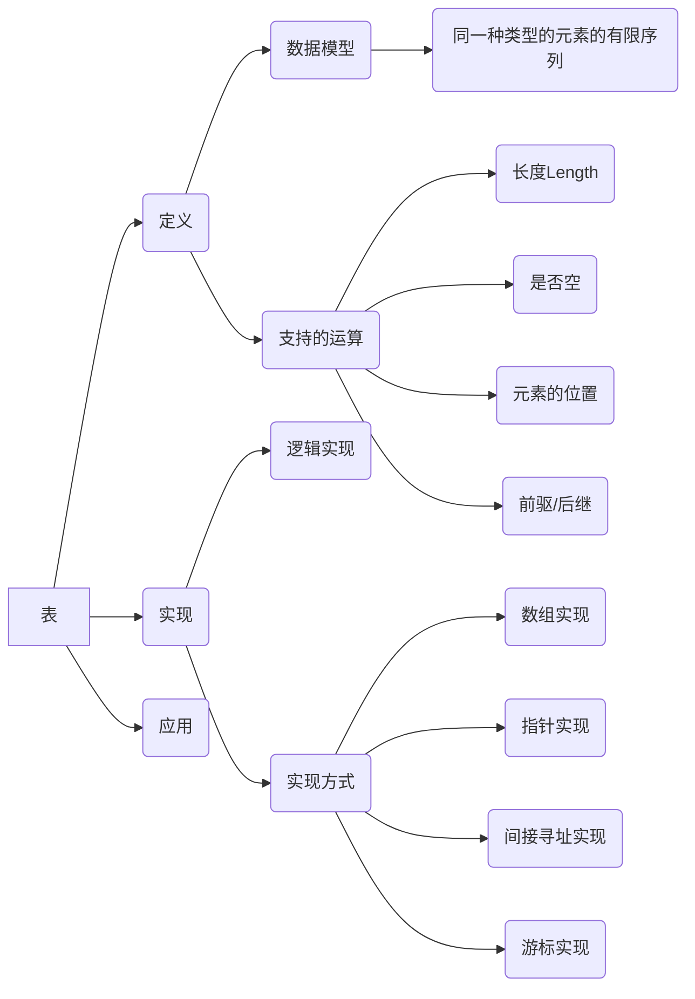
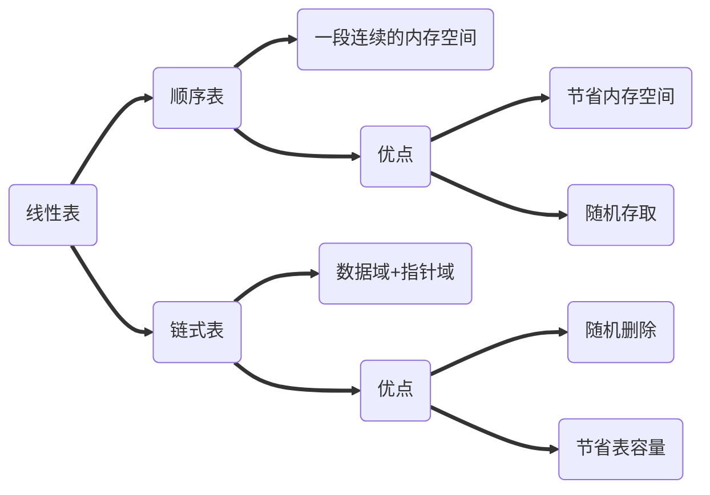
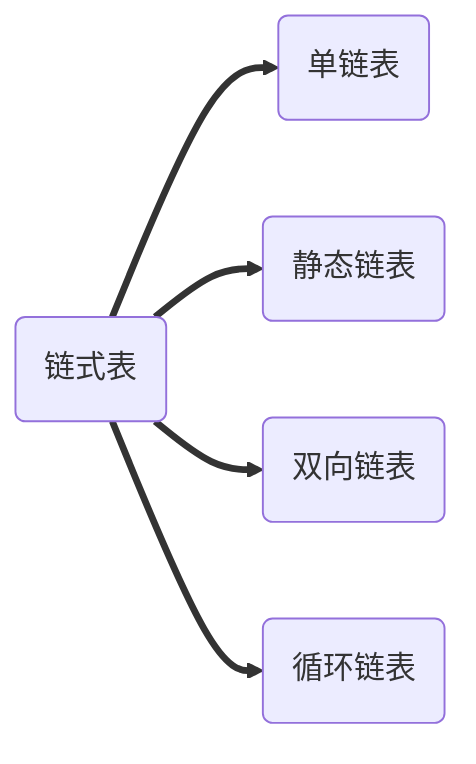

ADT表

## 定义

```mermaid
graph LR;
A[表] --> B(定义)
B --> C(数据模型)
C-->M(同一种类型的元素的有限序列)
B-->D(支持的运算)
D-->N(长度Length)
D-->O(是否空)
D-->P(元素的位置)
D-->Q(前驱/后继)
A -->E(实现)
E-->G(逻辑实现)
E-->H(实现方式)
H-->I(数组实现)
H-->J(指针实现)
H-->K(间接寻址实现)
H-->L(游标实现)
A-->F(应用)
```
## 定义

0个或多个数据元素组成的有限序列

```mermaid
graph LR;
A(线性表)==>B(顺序表)
A==>C(链式表)

B==>J(一段连续的内存空间)
B==>D(优点)
D==>F(节省内存空间)
D==>E(随机存取)

C==>K(数据域+指针域)
C==>I(优点)
I==>G(随机删除)
I==>H(节省表容量)

```

```mermaid
graph LR;

A(链式表)==>B(单链表)
A==>C(静态链表)
A==>D(双向链表)
A==>E(循环链表)
```

