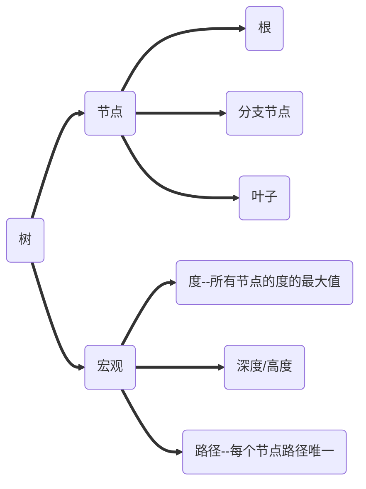
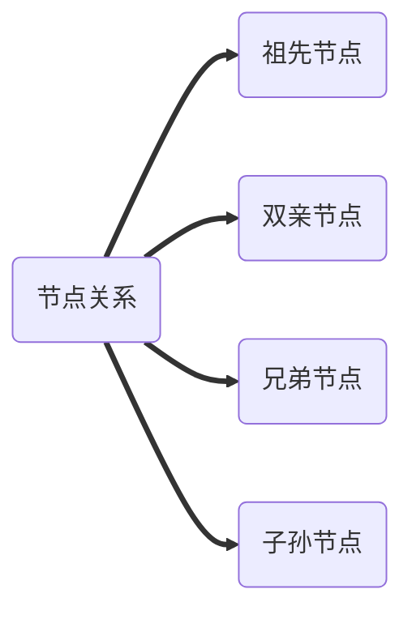
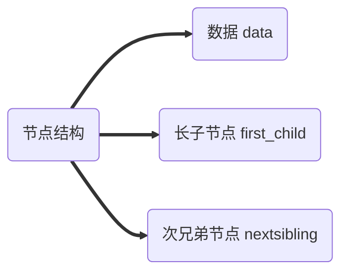
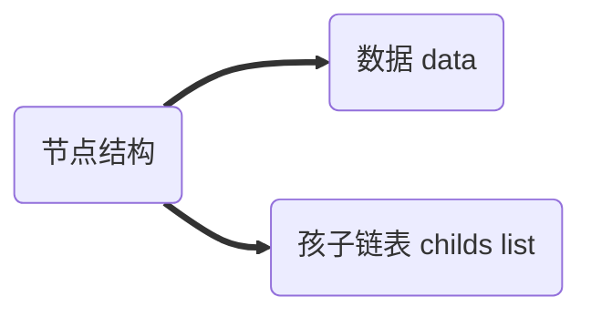
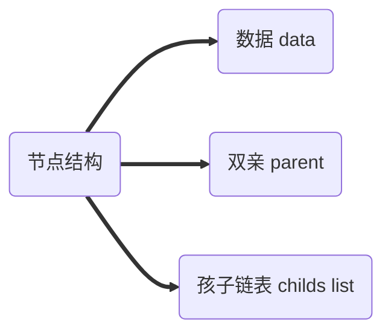

## 基本属性

```mermaid
graph LR;
A(树)==>B(节点)
B==>C(根)
B==>E(分支节点)
B==>D(叶子)

A==>F(宏观)
F==>H(度--所有节点的度的最大值)
F==>G(深度/高度)
F==>I(路径--每个节点路径唯一)


```

## 节点关系

```mermaid
graph LR;

A(节点关系)==>E(祖先节点)
A==>B(双亲节点)
A==>C(兄弟节点)
A==>D(子孙节点)
```

## 链式存储结构

### 二叉树表示法 (重点)

```mermaid
graph LR;
A(节点结构)==>B(数据 data)
A==>C(长子节点 first_child)
A==>D(次兄弟节点 nextsibling)
```

### 孩子链表表示

```mermaid
graph LR;
A(节点结构)==>B(数据 data)
A==>C(孩子链表 childs list)
```

### 孩子双亲链表表示

```mermaid
graph LR;
A(节点结构)==>B(数据 data)
A==>D(双亲 parent)
A==>C(孩子链表 childs list)
```