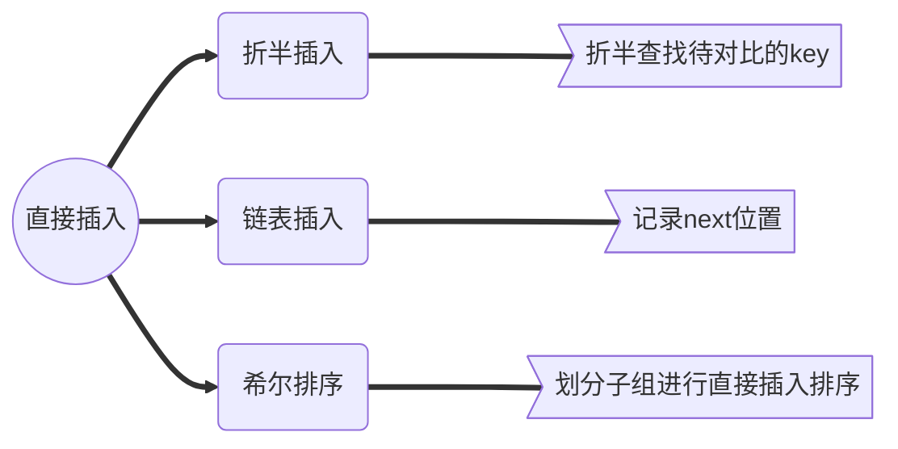
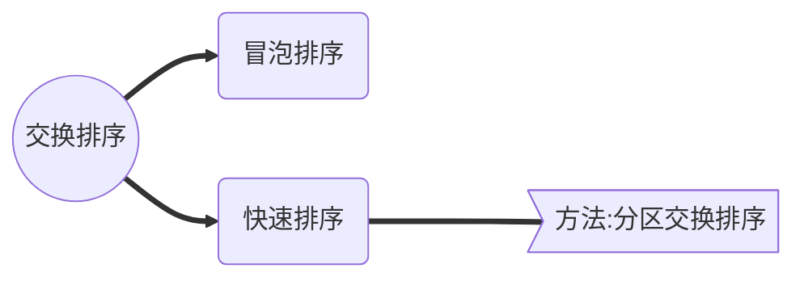
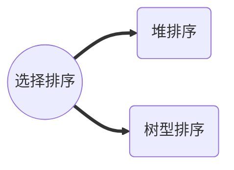

## 插入排序

三种改进方式

```mermaid
graph LR
A((直接插入))==>B(折半插入)
B====B1>"折半查找待对比的key"]
A==>C(链表插入)
C====C1>"记录next位置"]
A==>D(希尔排序)
D====D1>"划分子组进行直接插入排序"]
```

## 交换排序

性能最好的==快速排序==

```mermaid
graph LR
A((交换排序))==>B(冒泡排序)
A==>C(快速排序)
C====D>"方法:分区交换排序"]

```

## 选择排序

```mermaid
graph LR
A((选择排序))==>B(堆排序)
A==>C(树型排序)
```

