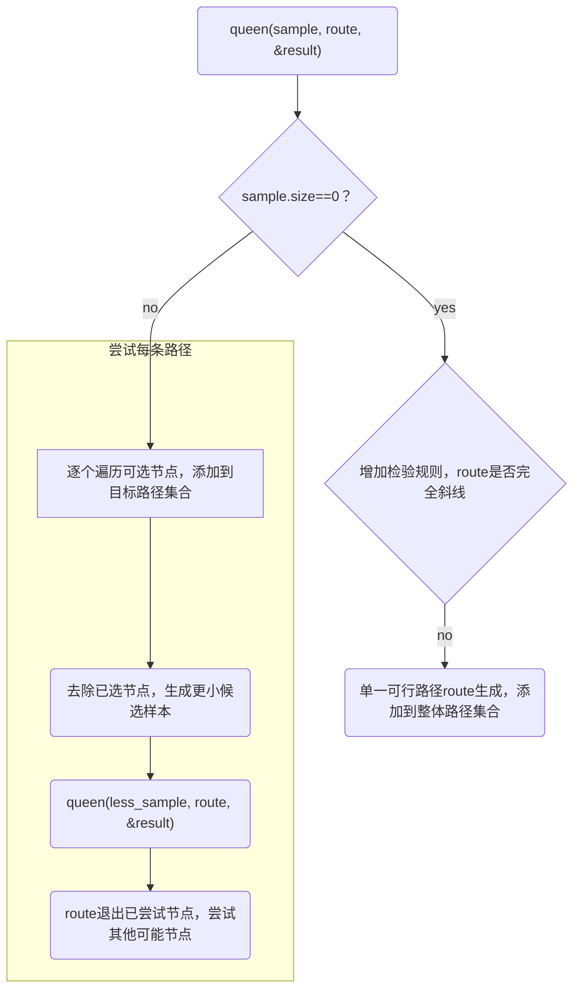

# N皇后问题

## 函数接口

候选节点集合： list< T > sample

单一可行路径（节点组合）：vector< T > route

所有可行路径：vector<vector< T > > result

## 流程图

```mermaid

graph TD

question("queen(sample, route, &result)")
neq0{"sample.size==0？"}
subgraph 尝试每条路径
    route_add_node["逐个遍历可选节点，添加到目标路径集合"]
    less_sample("去除已选节点，生成更小候选样本")
    less_question("queen(less_sample, route, &result)")
    route_pop_node("route退出已尝试节点，尝试其他可能节点")
end

check_rule{"增加检验规则，route是否完全斜线"}
question-->neq0-->|yes|check_rule-->|no|add_route("单一可行路径route生成，添加到整体路径集合")
neq0-->|no|route_add_node-->less_sample-->less_question-->route_pop_node

```