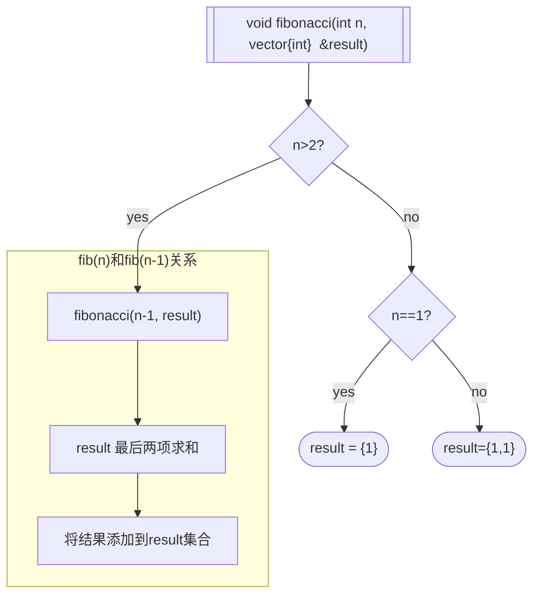

# 斐波那契数列

```mermaid
graph TB
    fib[["void fibonacci(int n, vector{int}  &result)"]]
    ngt2{n>2?}  
    fib-->ngt2
    
    neq1{n==1?} 
    res1(["result = {1}"])
    res2(["result={1,1}"])
    subgraph "fib(n)和fib(n-1)关系"
        fib1["fibonacci(n-1, result) "]
        add["result 最后两项求和"]
        res["将结果添加到result集合"]
        fib1-->add-->res
    end
    ngt2-->|yes| fib1
    ngt2-->|no| neq1
    neq1-->|yes| res1
    neq1-->|no| res2
    


```