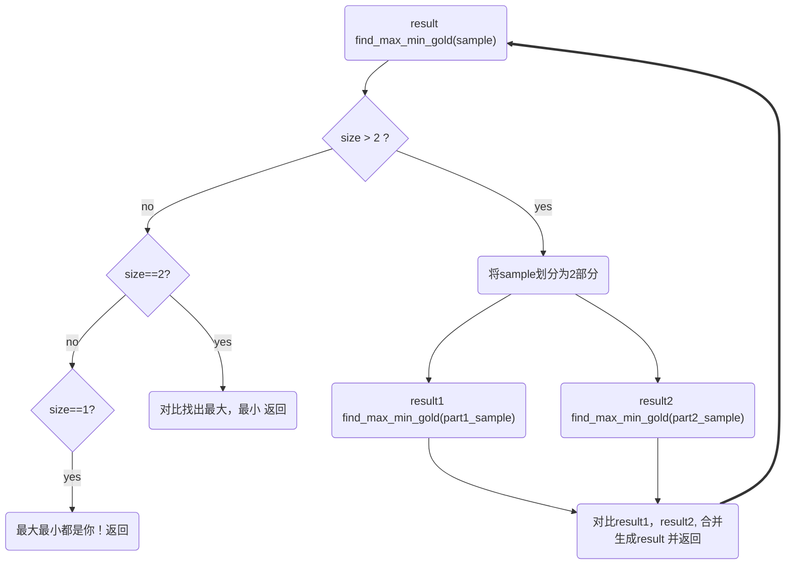

# 金块问题

**最少次数**，找出**最重和最轻**金块

## 函数接口

vector< T > sample

{ max, min }   find_max_min_gold(sample)

## 流程图

```mermaid
graph TD
question("result find_max_min_gold(sample)")
part1("result1 find_max_min_gold(part1_sample)")
part2("result2 find_max_min_gold(part2_sample)")
divide("将sample划分为2部分")

question-->is_gt_2{"size > 2 ?"}-->|no|is_only_two-->|no|is_only_one

is_gt_2-->|yes|divide-->part1-->merge("对比result1，result2, 合并生成result 并返回")==>question
divide-->part2-->merge

is_only_one{"size==1?"}-->|yes|one("最大最小都是你！返回")
is_only_two{"size==2?"}-->|yes|two("对比找出最大，最小 返回")

```

