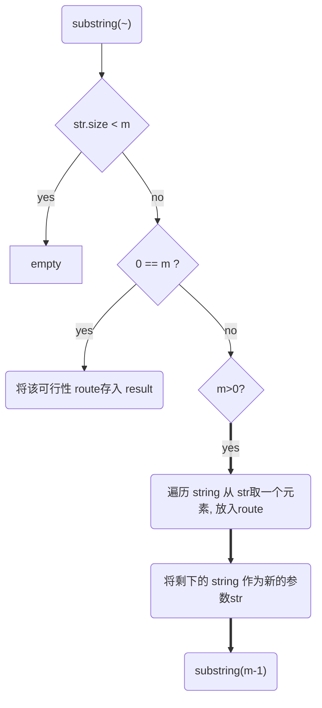

# 求子串

求 长度为 n 的字符串  所有的长度为m 的子串(n>m)

## 函数接口

​	

Substring(string str, size_t m,  string &route, vector<string> result)

- str 待处理的 str

- m 子串的长度
- route 某一子串
- result 子串集合

## 流程图

```mermaid
graph TD
str("substring(~)")
str-->strlen{str.size < m}-->|yes|empty
strlen-->|no|eqm{0 == m ?}-->|yes|add_result(将该可行性 route存入 result)

eqm-->|no|ltm{m>0?}==>|yes|route_add_node("遍历 string 从 str取一个元素, 放入route")==>new_patam("将剩下的 string 作为新的参数str ")==>less_str("substring(m-1)")

```

