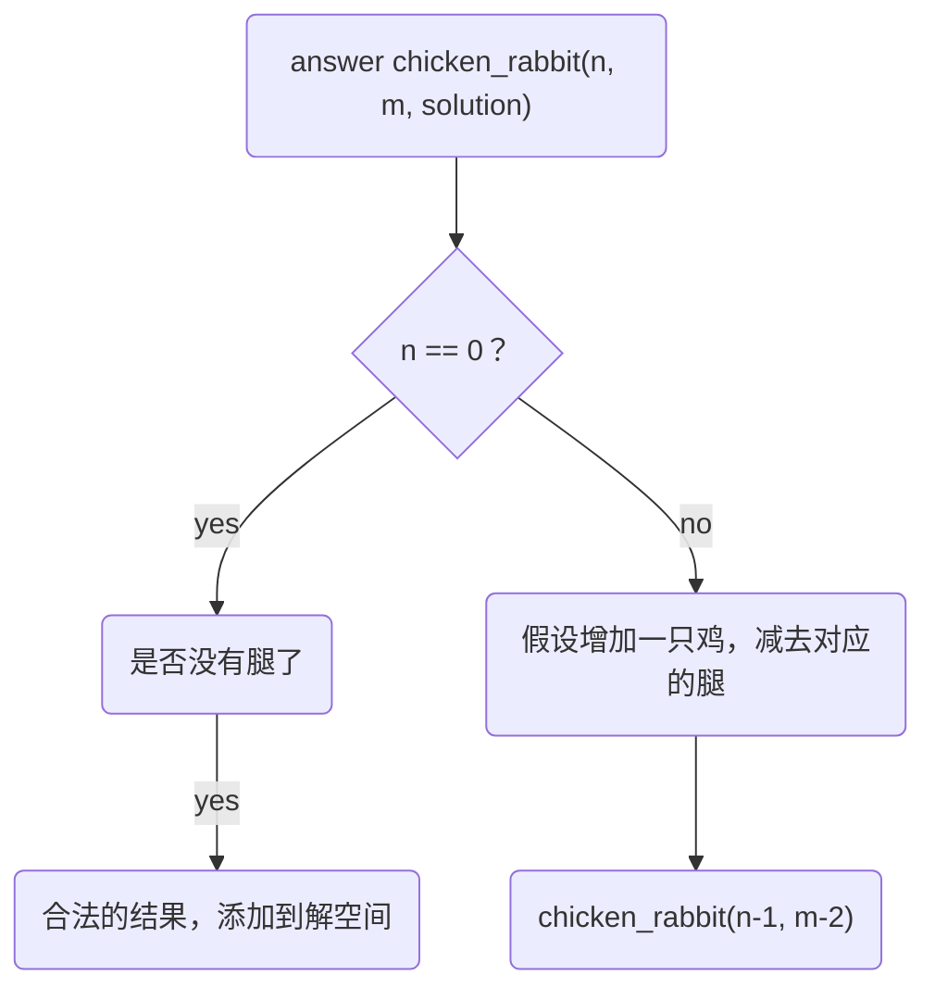

# 鸡兔同笼

in：> ddd

{{ i }} 

鸡兔 ：n ， 脚 m

可行的鸡兔数量 :  tuple(x, y) solution 

​		out： 

vector<tuple<x, y> > answer 

```mermaid
graph TD
question("answer chicken_rabbit(n, m, solution)")

question-->is_num_over{"n == 0？"}-->|yes|is_legs_empty("是否没有腿了")-->|yes|solution("合法的结果，添加到解空间")
is_num_over-->|no|new_condition("假设增加一只鸡，减去对应的腿")-->less_quesstion("chicken_rabbit(n-1, m-2)")
```

