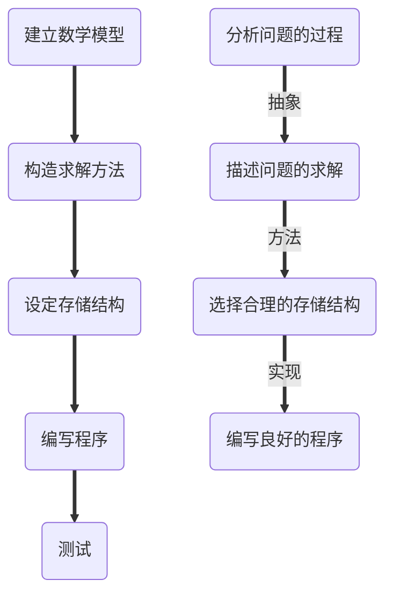

# 数据结构和算法笔记

## 计算机解决问题的步骤

```mermaid
graph TB;
A(建立数学模型)==>B(构造求解方法)
B==>D(设定存储结构)
D==>E(编写程序)
E==>F(测试)

H(分析问题的过程)==抽象==>I(描述问题的求解)
I==方法==>J(选择合理的存储结构)
J==实现==>K(编写良好的程序)
```

---

中国有一句话叫「闷声大发财」。我就什么话也不说。就是最好的！但是我想我见到你们这样热情啊，一句话不说也不好。

你们啊，不要想……喜欢……这…欸呵弄个大新闻，说现在已经钦定了，再把我批判一番。

