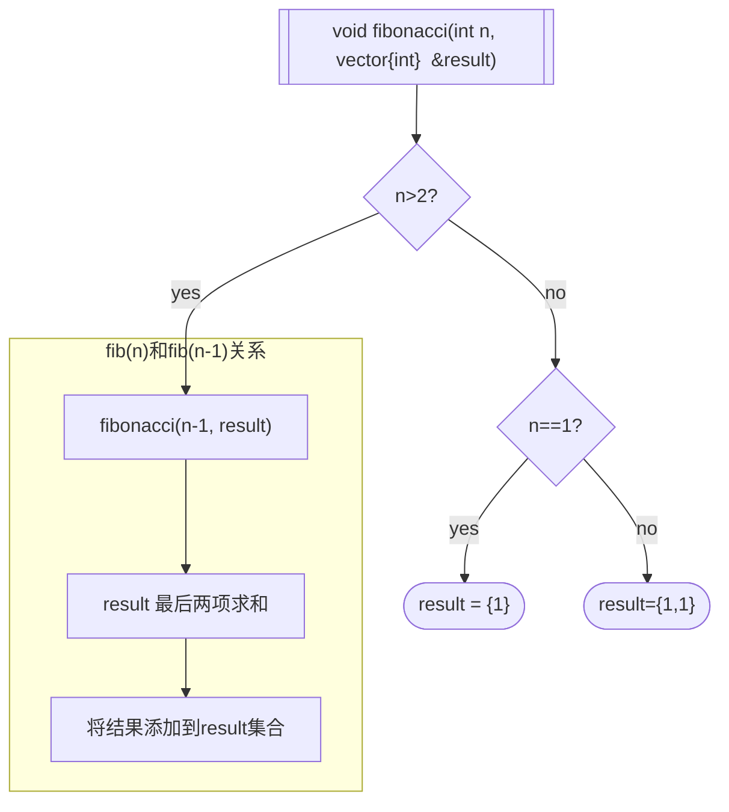
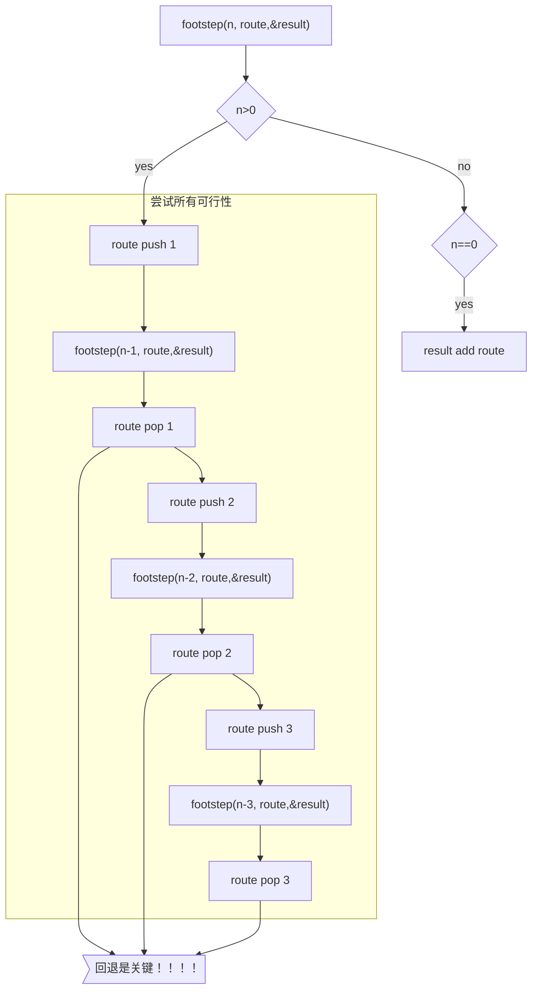

# 递归

## 算法思想

1. 在定义中（直接或者间接）调用自身

2. 复杂问题转化为规模较小的相似问题

3. **少量代码可以描述复杂的计算过程，减少了代码量**

   

### 代码结构

1. 边界条件，递归终止
2. 递归关系式（原问题如何分解为子问题的？）

### 思路

1. 降低问题规模
2. 求解最小子问题

## 斐波那契数列

```mermaid
graph TB
    fib[["void fibonacci(int n, vector{int}  &result)"]]
    ngt2{n>2?}  
    fib-->ngt2
    
    neq1{n==1?} 
    res1(["result = {1}"])
    res2(["result={1,1}"])
    subgraph "fib(n)和fib(n-1)关系"
        fib1["fibonacci(n-1, result) "]
        add["result 最后两项求和"]
        res["将结果添加到result集合"]
        fib1-->add-->res
    end
    ngt2-->|yes| fib1
    ngt2-->|no| neq1
    neq1-->|yes| res1
    neq1-->|no| res2
    


```

## 台阶问题

```mermaid
graph TB
qa["footstep(n, route,&result)"]-->ngt3{n>0}
p01["result add route"]


p11["footstep(n-1, route,&result)"]
p12["footstep(n-2, route,&result)"]
p13["footstep(n-3, route,&result)"]


p21["route push 1"]
p22["route push 2"]
p23["route push 3"]

p31["route pop 1"]
p32["route pop 2"]
p33["route pop 3"]

note>"回退是关键！！！！"]
subgraph 尝试所有可行性
	p21-->p11-->p31-->p22-->p12-->p32-->p23-->p13-->p33
end
p31-->note
p32-->note
p33-->note

ngt3-->|yes|p21
ngt3-->|no|neq0{n==0}-->|yes|p01


```

