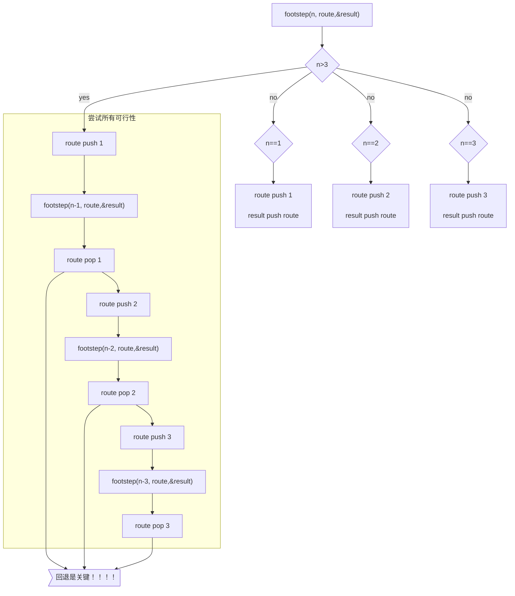

# 递归

## 斐波那契数列

```mermaid
graph TB
    fib[["void fibonacci(int n, vector{int}  &result)"]]
    ngt2{n>2?}  
    fib-->ngt2
    
    neq1{n==1?} 
    res1(["result = {1}"])
    res2(["result={1,1}"])
    subgraph "fib(n)和fib(n-1)关系"
        fib1["fibonacci(n-1, result) "]
        add["result 最后两项求和"]
        res["将结果添加到result集合"]
        fib1-->add-->res
    end
    ngt2-->|yes| fib1
    ngt2-->|no| neq1
    neq1-->|yes| res1
    neq1-->|no| res2
    


```

## 台阶问题

vector<int> route

vector<vector<int>> result

```mermaid
graph TB
qa["footstep(n, route,&result)"]
ngt3{n>3}

qa-->ngt3
p01["
route push 1<br>
result push route"]
p02["
route push 2<br>
result push route"]
p03["
route push 3<br>
result push route"]

p11["footstep(n-1, route,&result)"]
p12["footstep(n-2, route,&result)"]
p13["footstep(n-3, route,&result)"]
neq1{n==1}
neq2{n==2}
neq3{n==3}


p21["route push 1"]
p22["route push 2"]
p23["route push 3"]

p31["route pop 1"]
p32["route pop 2"]
p33["route pop 3"]

note>"回退是关键！！！！"]
subgraph 尝试所有可行性
p21-->p11-->p31-->p22-->p12-->p32-->p23-->p13-->p33

end
p31-->note
p32-->note
p33-->note

ngt3-->|yes|p21
ngt3-->|no|neq1-->p01
ngt3-->|no|neq2-->p02
ngt3-->|no|neq3-->p03


```

# sss

