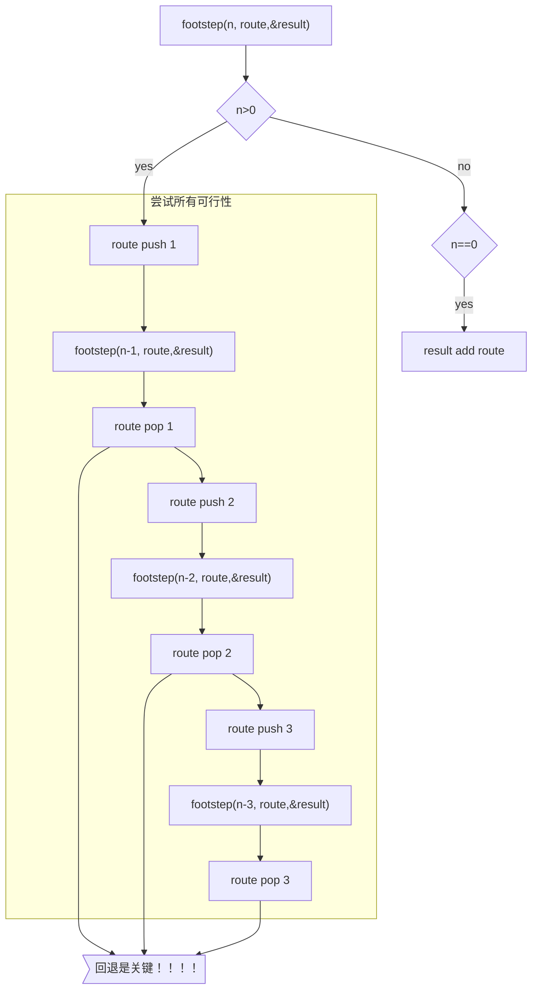

# 台阶问题

```mermaid
graph TB
qa["footstep(n, route,&result)"]-->ngt3{n>0}
p01["result add route"]


p11["footstep(n-1, route,&result)"]
p12["footstep(n-2, route,&result)"]
p13["footstep(n-3, route,&result)"]


p21["route push 1"]
p22["route push 2"]
p23["route push 3"]

p31["route pop 1"]
p32["route pop 2"]
p33["route pop 3"]

note>"回退是关键！！！！"]
subgraph 尝试所有可行性
	p21-->p11-->p31-->p22-->p12-->p32-->p23-->p13-->p33
end
p31-->note
p32-->note
p33-->note

ngt3-->|yes|p21
ngt3-->|no|neq0{n==0}-->|yes|p01


```