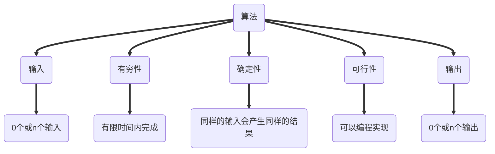
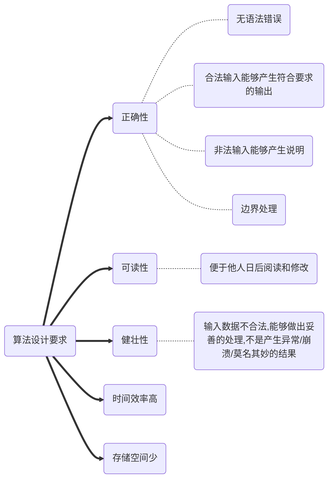

## 算法特性

```mermaid
graph TB;
A(算法)==>B(输入)
A==>D(有穷性)
A==>E(确定性)
A==>F(可行性)
A==>C(输出)

B==>G(0个或n个输入)
C==>H(0个或n个输出)
D==>I(有限时间内完成)
E==>J(同样的输入会产生同样的结果)
F==>K(可以编程实现)

```

## 算法设计要求

```mermaid
graph LR;
A(算法设计要求)==>B(正确性)
B-.-C(无语法错误)
B-.-D(合法输入能够产生符合要求的输出)
B-.-E(非法输入能够产生说明)
B-.-F(边界处理)
A==>G(可读性)
G-.-H(便于他人日后阅读和修改)
A==>I(健壮性)
I-.-J(输入数据不合法,能够做出妥善的处理,不是产生异常/崩溃/莫名其妙的结果)
A==>K(时间效率高)
A==>L(存储空间少)
```

