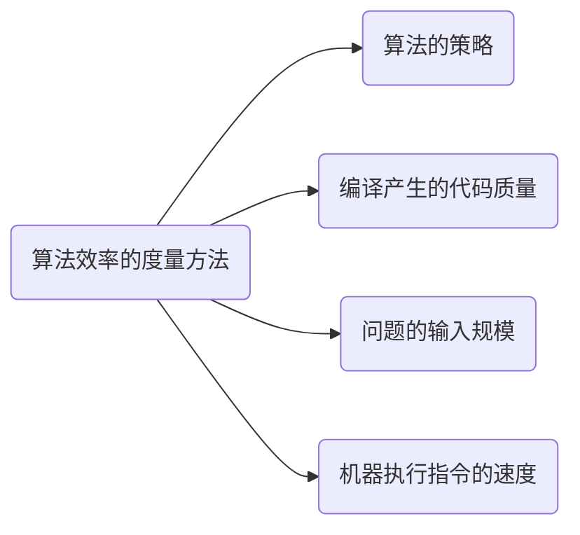
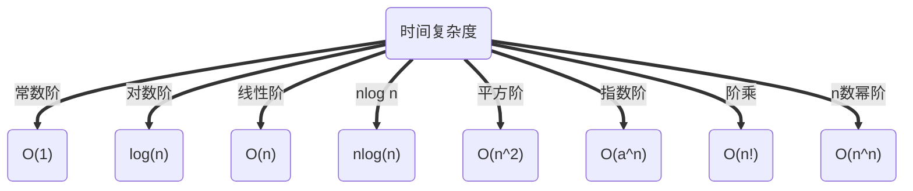

## 算法效率的度量

```mermaid
graph LR;
A(算法效率的度量方法)-->B(算法的策略)
A-->C(编译产生的代码质量)
A-->D(问题的输入规模)
A-->E(机器执行指令的速度)
```

## 时间复杂度

```mermaid
graph TD;
A(时间复杂度)==常数阶==>B("O(1)")
A==对数阶==>E("log(n)"  )
A==线性阶==>C("O(n)")
A==nlog n==>D("nlog(n)")
A==平方阶==>F("O(n^2)")
A==指数阶==>G("O(a^n)")
A==阶乘==>I("O(n!)")
A== n数幂阶 ==>H("O(n^n)")
```

$$O(n^3)$$ 之后的 随n的增大, 复杂度超乎想象

## 算法复杂度

算法最坏情况下的运行时间

时间复杂度: 指令的运行次数

空间复杂度: 运行代码的内存空间需求

