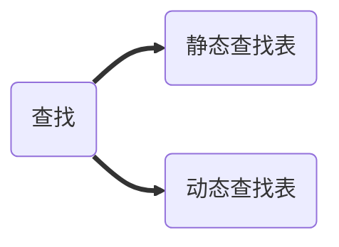
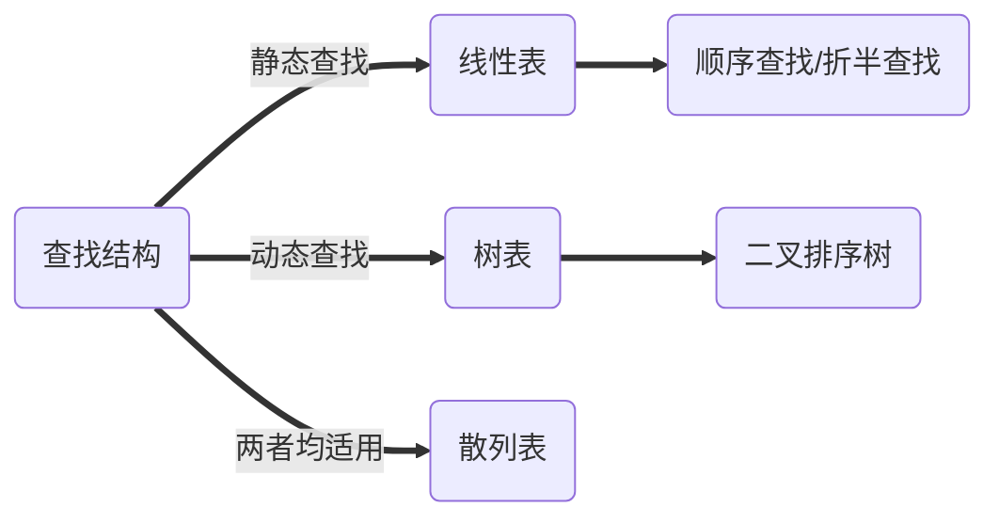

## 查找分类

## 查找结构

## 顺序查找

设第i次查找次数为$C_i$ ,该$ C_i $次数的查找概率 $P_i$ ,则 

ASL = \sum_{i=1}^n C_iP_i \\
ASL = \sum_{i=1}^n n \times \frac{1}{n} = \frac{n+1}{2} \\
ASL = \frac{n/2+1}{2} +  \sum_{i=1}^{n/2} n \times 1/2 =  \frac{n/2+1}{2} + n/2

## 二叉排序树

### 定义

左子节点均小于父节点

右子节点均大于父节点

### 查找效率

最好的情况: O(log_2n ) \\

最差的情况: O（n）

