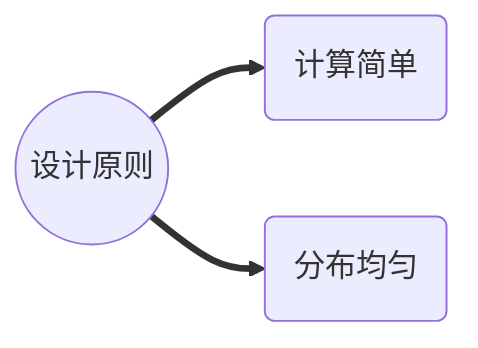
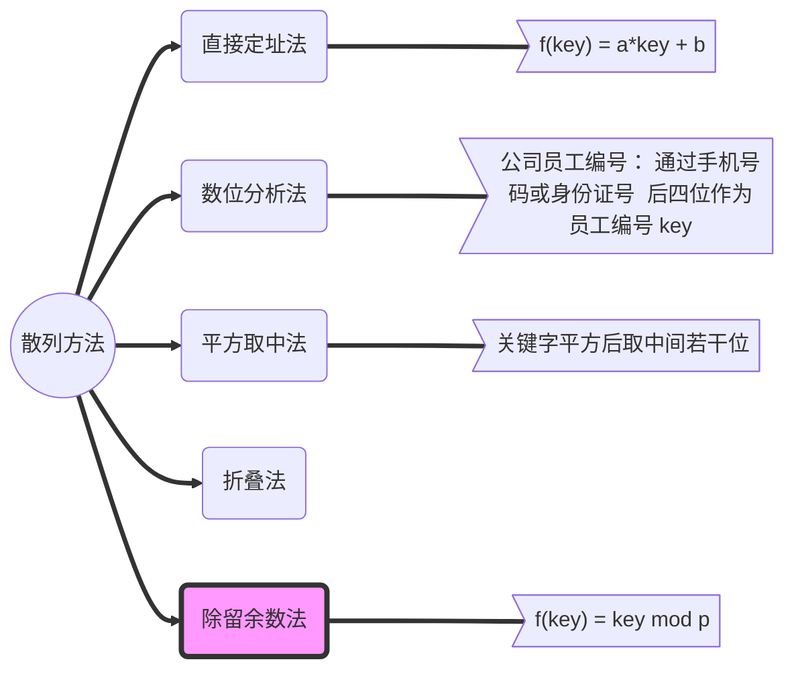
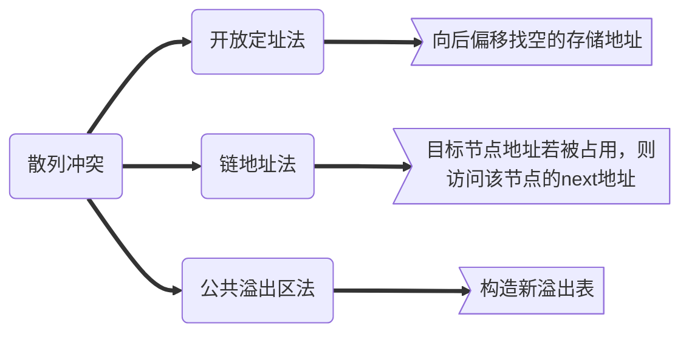

## 散列

关键字和值之间建立映射关系

专注于查找一对一关系

### 散列函数

通过关键字返回记录的地址

目标：让目标地址冲突尽可能少，存储分布均匀

## 常见散列方法

通过关键字计算出目标存储地址，建立线性映射

## 散列函数优劣判定

1. 计算散列地址所需的时间
2. 关键字的长度
3. 散列表的大小
4. 关键字的稀疏分布
5. 记录查找的频率

## 散列冲突

