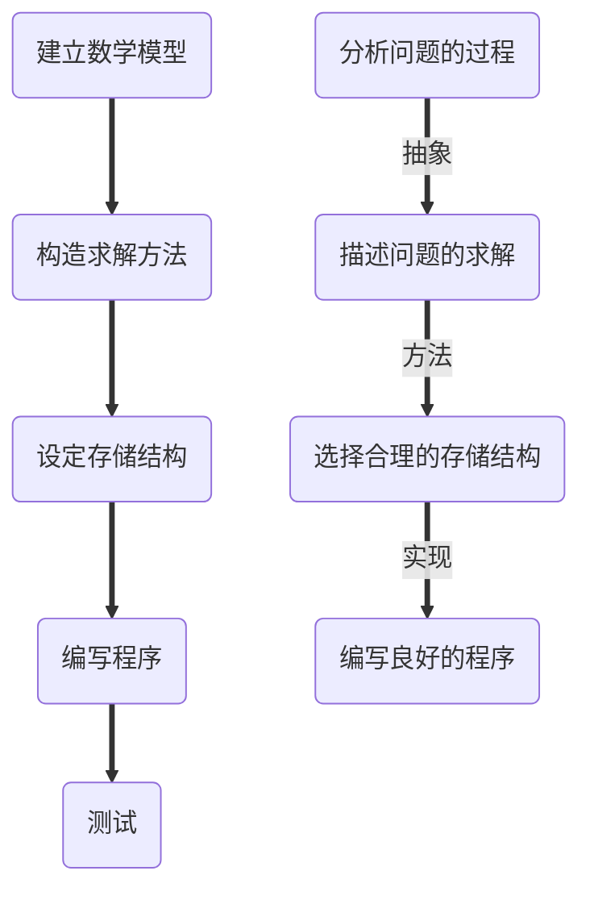
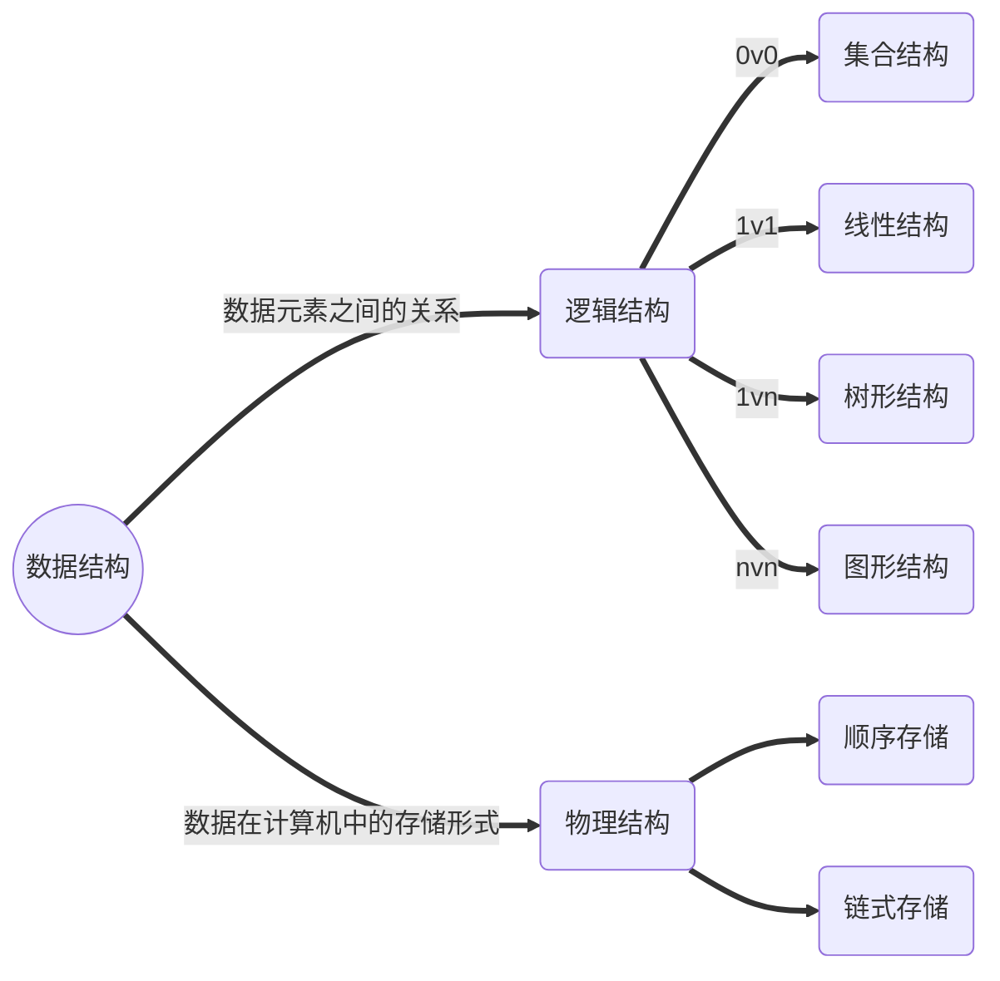

## 计算机解决问题的步骤

```mermaid
graph TB;
A(建立数学模型)==>B(构造求解方法)
B==>D(设定存储结构)
D==>E(编写程序)
E==>F(测试)

H(分析问题的过程)==抽象==>I(描述问题的求解)
I==方法==>J(选择合理的存储结构)
J==实现==>K(编写良好的程序)
```

## 数据结构分类

```mermaid
graph LR;
B((数据结构))==数据元素之间的关系==>D(逻辑结构)
B==数据在计算机中的存储形式==>E(物理结构)

D==>|0v0|H(集合结构)
D==>|1v1|I(线性结构)
D==>|1vn|J(树形结构)
D==>|nvn|K(图形结构)
E==>L(顺序存储)
E==>M(链式存储)

```
